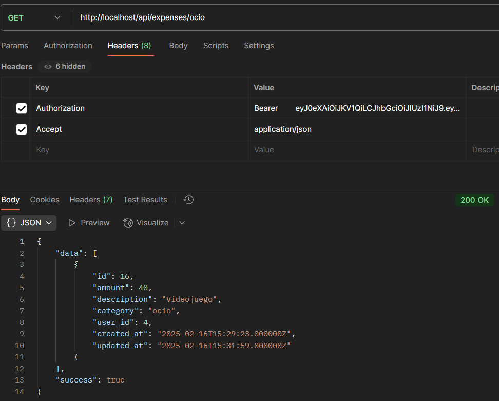

# Descripción proyecto

Este proyecto consiste en una API para poder gestionar los gastos personales. Permite a los usuarios registrarse, listar, editar y eliminar sus gastos.

# Instalación

-   `git clone` del repositorio
-   `composer install` para instalar las dependencias necesarias
-   Crear archivo `.env` siguiendo `.env.example`
-   Crear el archivo `database.sqlite` y `testing.sqlite` en `database`
-   Levantar el proyecto `./vendor/bin/sail up -d`
-   Generar clave `./vendor/bin/sail artisan key:generate`
-   Aplicar las migraciones `./vendor/bin/sail artian migrate`

# Historias de usuario

En todos los pasos excepto en el de registro es obligatorio poner el token en Headers.

## Registro

Al registrarse se obtiene el token necesario para realizar las demás operaciones. Tener en cuenta que este token dura 60 minutos.

## Ver Usuario Activo

Podemos ver los datos del usuario que estamos utilizando.

## Crear Gasto

Creamos un gasto rellenando los campos necesarios. Las categorías disponibles son:

-   Comida
-   Ocio
-   Electrónica
-   Utilidades
-   Ropa
-   Salud
-   Otros

## Editar Gasto

Editamos un gasto rellenando los campos necesarios.

## Listar Gastos

Podemos listar todos los gastos que hemos creado.

## Listar Gastos Por Categorias

Podemos listar los gastos de una determinada categoría

## Borrar Gasto

Borramos un gasto.

